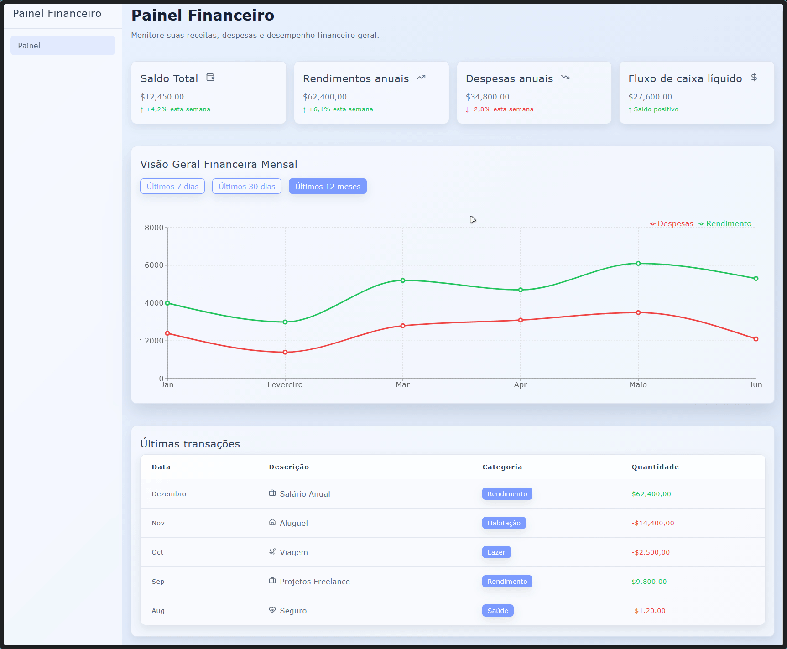

# Financial Dashboard

A modern and responsive financial dashboard built with React, TypeScript, Recharts and Aurora CSS.

## Preview



## Features

- Responsive dashboard layout
- Financial summary cards
- Interactive line chart
- Dynamic period filters (7 days, 30 days and 12 months)
- Transaction history table
- Category badges and icons
- Built with reusable React components

## Technologies

- React
- TypeScript
- Vite
- Recharts
- Lucide React
- Aurora CSS


## Project Structure

```
src/
├── assets/
├── components/
│   ├── Dashboard.tsx
│   ├── OverviewChart.tsx
│   └── Sidebar.tsx
├── data/
│   └── financialData.ts
├── types/
│   ├── period.ts
│   └── summary.ts
├── App.tsx
└── main.tsx

vendor/
└── aurora/
```

## License

MIT License